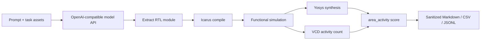

# RTLBench

A lightweight benchmark harness for evaluating LLM-generated RTL with simulation, synthesis, and area/activity scoring.

RTLBench helps you ask a simple question with real engineering gates behind it: _did the model generate usable RTL, and what did it cost under a public, reproducible flow?_

[Quick start](#quick-start) - [RFID-APBench](#rfid-apbench) - [Scoring](#scoring) - [Docs](#useful-docs)

> [!IMPORTANT]
> RTLBench is an evaluation repository, not a fine-tuning repository. It does not contain private RTL, training datasets, adapters, model weights, or raw model outputs.

## What It Does

| Capability | What RTLBench records |
| --- | --- |
| OpenAI-compatible generation | Model endpoint, prompt profile, request metadata, token metadata |
| RTL extraction | Complete module extraction for the expected top module |
| Correctness gates | Compile and functional simulation outcomes |
| Synthesis | Yosys generic-cell synthesis results |
| Activity proxy | VCD toggle-count activity under declared workloads |
| Reporting | Sanitized Markdown, CSV, and JSONL summaries |

RTLBench is designed for public benchmark work where repeatability and artifact hygiene matter more than raw throughput.

## Why It Exists

RTL generation benchmarks often stop at syntax or compile success. RTLBench keeps the flow closer to hardware reality:

- extract the generated RTL
- compile it
- run deterministic functional checks
- synthesize it
- measure generic area
- count VCD toggles as an activity proxy
- score only candidates that pass the required gates

This makes failures easier to classify and helps avoid overclaiming from lint-only or synthesis-only results.

## What's Included

- `src/rtlbench/`: reusable API client, adapters, extraction, evaluation, scoring, reporting, and dashboard helpers
- `benchmarks/rfid_apbench/`: current public/synthetic RFID/NFC-style benchmark
- `scripts/`: benchmark runners, report builders, validators, and utility scripts
- `configs/`: model presets, prompt profiles, and benchmark configs
- `tests/`: unit tests for clients, adapters, scoring, reporting, extraction, and RFID-APBench flows
- `docs/release/`: release, reproducibility, and report-hygiene docs for RFID-APBench

The harness also has adapters for VerilogEval v2, RTLLM 2.0, ProtocolLLM public lint, and RTL-OPT flows, but the current active benchmark documentation focuses on RFID-APBench.

## RFID-APBench

RFID-APBench is a public/synthetic RFID/NFC-style RTL benchmark for correctness-gated area/activity evaluation.

- 10 small tasks under `benchmarks/rfid_apbench/tasks/`
- public prompts, references, testbenches, and workloads
- deterministic compile/simulation correctness gates
- Yosys generic-cell area
- VCD toggle-count activity proxy
- sanitized report outputs only

> [!NOTE]
> Activity is a VCD toggle-count proxy from a declared public workload. It is not measured silicon power, signoff power, final silicon PPA, or production QoR.

Current task inventory:

| Task | Summary |
| --- | --- |
| `ap_001_idle_counter` | Idle-aware saturating counter |
| `ap_002_command_decoder` | Small command decoder |
| `ap_003_register_bank_unnecessary_writes` | Register bank with stable disabled writes |
| `ap_004_crc_serial_parallel_tradeoff` | CRC update block |
| `ap_005_fsm_controller_idle_activity` | Low-duty-cycle controller FSM |
| `ap_006_wakeup_edge_filter` | Enabled rising-edge wakeup pulse filter |
| `ap_007_command_frame_checker` | Command-frame validity checker |
| `ap_008_byte_lane_write_gate` | Byte-lane gated register writes |
| `ap_009_serial_parity_accumulator` | Serial parity and bit-count accumulator |
| `ap_010_retry_timeout_fsm` | Retry and timeout controller |

## Evaluation Flow



Rows that fail extraction, compile, simulation, synthesis, or metric availability are reported with failure categories and excluded from valid-score means.

## Quick Start

### 1. Install

```bash
python -m pip install -e ".[dev]"
```

Install the local RTL tools used by RFID-APBench:

- Icarus Verilog: `iverilog`
- Icarus runtime: `vvp`
- Yosys

On Windows, confirm the tools are visible:

```powershell
where.exe iverilog
where.exe vvp
where.exe yosys
```

### 2. Configure A Model Endpoint

RTLBench uses OpenAI-compatible APIs. Use placeholders in docs and commits; keep real values local.

```powershell
$env:QWEN_BASE_URL = "http://<host>:<port>/v1"
$env:QWEN_API_KEY = "<api-key-or-local-placeholder>"
$env:QWEN_MODEL = "qwen36-27b"
$env:QWEN_TIMEOUT = "120"
```

You can also use a local `.env` file:

```dotenv
QWEN_BASE_URL=http://<host>:<port>/v1
QWEN_API_KEY=<api-key-or-local-placeholder>
QWEN_MODEL=qwen36-27b
QWEN_TIMEOUT=120
```

`.env` is ignored and must not be committed.

> [!TIP]
> Model presets live in `configs/models.yaml`. The `qwen36-27b` preset forwards `chat_template_kwargs.enable_thinking=false` through the runner's `extra_body` path.

### 3. Run Tests

```bash
python -m pytest
```

### 4. Run RFID-APBench

Example full 10-task x 3-sample run:

```powershell
python scripts\run_rfid_apbench_3sample_baseline.py `
  --benchmark-root benchmarks\rfid_apbench `
  --samples-per-task 3 `
  --prompt-profile neutral_baseline `
  --temperature 0.0 `
  --top-p 1.0 `
  --max-tokens 4096 `
  --output-md reports\rfid_apbench_baseline.md `
  --output-csv reports\rfid_apbench_baseline.csv `
  --output-jsonl reports\rfid_apbench_baseline.jsonl `
  --output-root outputs\rfid_apbench\baseline `
  --work-dir .tmp\rfid_apbench_baseline
```

Targeted run for one task:

```powershell
python scripts\run_rfid_apbench_3sample_baseline.py `
  --task-id ap_001_idle_counter `
  --samples-per-task 3 `
  --prompt-profile neutral_baseline `
  --max-tokens 4096 `
  --output-md reports\rfid_apbench_ap001.md `
  --output-csv reports\rfid_apbench_ap001.csv `
  --output-jsonl reports\rfid_apbench_ap001.jsonl `
  --output-root outputs\rfid_apbench\ap001 `
  --work-dir .tmp\rfid_apbench_ap001
```

## Outputs

Commit-safe outputs are sanitized reports:

```text
reports/
  *.md      human-readable summaries
  *.csv     row-level tabular summaries
  *.jsonl   sanitized structured rows
```

Raw and generated artifacts stay ignored:

```text
outputs/          raw responses, extracted RTL, run logs
.tmp/             evaluator work directories and compiled scratch
*.vcd             activity waveforms
```

## Scoring

RFID-APBench uses correctness-gated `area_activity` scoring.

1. **Extraction**: find a complete module for the required top module.
2. **Compile**: compile candidate RTL with Icarus Verilog.
3. **Correctness**: pass the public functional simulation testbench.
4. **Synthesis**: synthesize with Yosys and read generic cell counts.
5. **Activity**: count VCD signal toggles in the declared workload window.
6. **Score**: combine area and activity score terms only for valid rows.

Invalid rows are counted as zero in all-sample score summaries. Valid-score means include only rows with valid scores.

## Repository Layout

```text
benchmarks/rfid_apbench/  Public synthetic RFID benchmark assets
configs/                  Model presets, prompt profiles, benchmark configs
docs/                     User and release documentation
reports/                  Sanitized reports only
runs/                     Baseline registry metadata
scripts/                  Runners, validators, exporters, report builders
src/rtlbench/             Python package
tests/                    Unit tests
outputs/                  Ignored raw run artifacts
.tmp/                     Ignored scratch/work directories
```

## Artifact And Security Policy

Do not commit:

- private RTL or private task text
- raw prompts beyond public benchmark prompts
- raw model responses or response bodies
- generated model RTL
- VCD files, simulator logs, synthesis logs, compiled artifacts, or scratch
- secrets, endpoint credentials, private absolute paths
- datasets, adapters, model weights, fine-tuning scripts

> [!CAUTION]
> RTLBench is not a place to store training data, LoRA/QLoRA/DoRA adapters, checkpoints, model weights, or private evaluation traces.

## Current Status And Limitations

- RFID-APBench is public/synthetic and currently contains 10 tasks.
- The v0.7 post-fix baseline closed the prior empty/null-content response-boundary issue for the recorded evidence.
- The known v0.7 limitation is localized to `ap_006_wakeup_edge_filter` candidate behavior in that run.
- Area is Yosys generic cells, not foundry area.
- Activity is VCD toggle count, not measured power.
- Reports are evaluation artifacts, not fine-tuning readiness evidence.

## Useful Docs

- [RFID-APBench overview](docs/rfid_apbench.md)
- [RFID-APBench release checklist](docs/release/rfid_apbench_release_checklist.md)
- [RFID-APBench reproducibility guide](docs/release/rfid_apbench_reproducibility.md)
- [RFID-APBench report hygiene](docs/release/rfid_apbench_report_hygiene.md)
- [RFID-APBench task schema](docs/rfid_apbench_task_schema.md)
- [Fine-tuning boundary](docs/fine_tuning_boundary.md)
- [Docs index](docs/index.md)
